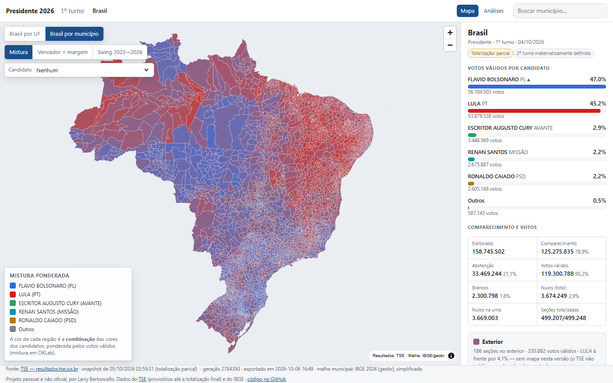
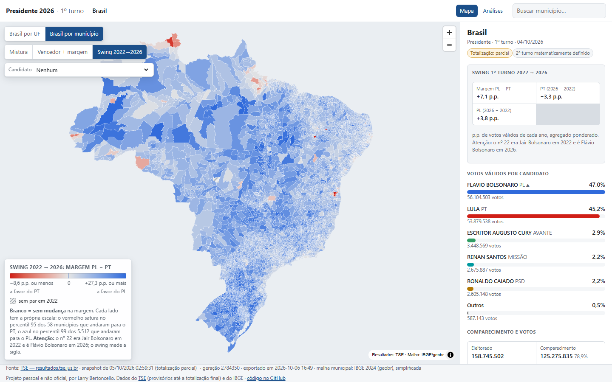
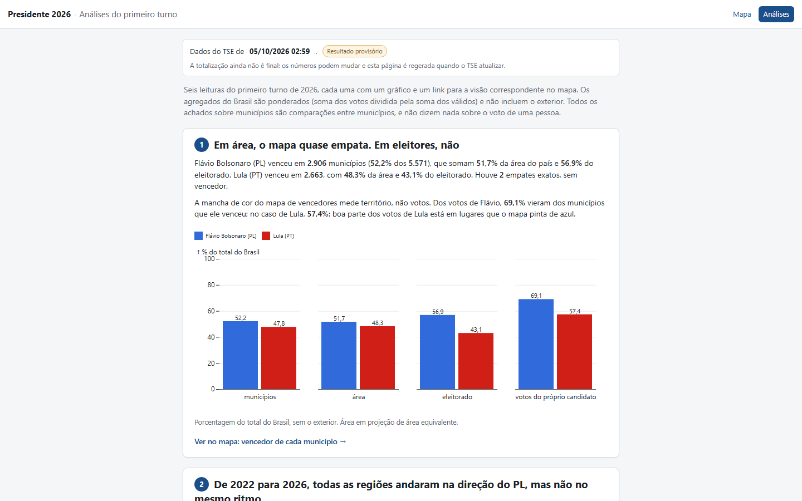

# Presidente 2026: mapa e análises do 1º turno

[](https://github.com/larrybers87/analise_eleicoes_2026/actions/workflows/pages.yml)

### **[larrybers87.github.io/analise_eleicoes_2026](https://larrybers87.github.io/analise_eleicoes_2026/)** · [página de análises](https://larrybers87.github.io/analise_eleicoes_2026/analises.html)

Mapa interativo e análises do resultado da eleição presidencial de 2026 no Brasil, por estado
e pelos 5.571 municípios (com o exterior à parte), feitos a partir dos dados oficiais do TSE.
Cada candidato tem uma cor fixa e a cor de cada região é a mistura ponderada pelos votos; dá
para destacar um candidato, comparar com 2022 e ler seis achados com gráficos e ressalvas.
Projeto pessoal e não oficial: os dados do TSE são provisórios até a totalização final.

| Brasil por município (mistura dos votos) | Swing 2022 → 2026 |
|---|---|
|  |  |



## Funcionalidades

- **Mapa por estado e por município**, com drill-down Brasil → estado → município e busca por nome.
- **Dois modos de cor**: mistura ponderada pelos votos (em OKLab) e vencedor com intensidade pela margem.
- **Seleção de candidato**: "onde venceu" (só onde ele foi 1º) e "força" (% dos válidos dele em todo o mapa).
- **Swing 2022 → 2026**: quanto a margem do PL sobre o PT mudou em cada município e estado.
- **Painel de resultados** da região clicada: votos por candidato, comparecimento, abstenção, brancos e nulos; exterior em tabela.
- **[Página de análises](https://larrybers87.github.io/analise_eleicoes_2026/analises.html)**: seis achados (o mapa engana, onde mudou, tamanho da cidade, renda e voto, redutos, participação), cada um com link para a visão no mapa.
- Toda visão tem endereço próprio (`?camada=mun&modo=swing`, `?uf=go&candidato=55&modo=forca`…), pronto para compartilhar.

## Stack

Python 3.12 (`httpx`, `pandas`, `duckdb`, `geopandas`/`geobr`, `statsmodels`, `esda`) gera
Parquet e os JSON do site; o site é estático (MapLibre GL JS, topojson-client e Observable
Plot via CDN, JavaScript sem build step), publicado no GitHub Pages. Todas as cores são
calculadas em Python. Decisões e motivos em [`docs/DECISOES.md`](docs/DECISOES.md).

## Fontes de dados e licenças

- **Resultados eleitorais 2026 e 2022**: [Tribunal Superior Eleitoral](https://resultados.tse.jus.br)
  (API de divulgação e [Portal de Dados Abertos](https://dadosabertos.tse.jus.br)), sob licença
  Creative Commons Atribuição (CC BY). Fonte: Tribunal Superior Eleitoral (TSE).
- **Malha municipal, população (Censo 2022) e PIB municipal (2023)**: [Instituto Brasileiro de Geografia e
  Estatística](https://www.ibge.gov.br), via [`geobr`](https://github.com/ipeaGIT/geobr) (Ipea) e
  SIDRA/FTP do IBGE, sob licença Creative Commons Atribuição (CC BY). Fonte: IBGE.
- Detalhes, URLs e armadilhas dos dados: [`docs/DADOS.md`](docs/DADOS.md).

**Código**: licença [MIT](LICENSE) © 2026 Larry Bertoncello.

## Rodar localmente

Requer Anaconda/Miniconda (testado em Windows).

```bash
conda env create -f environment.yml
conda activate eleicao2026
nbstripout --install --attributes .gitattributes   # uma vez por clone

cd web && python -m http.server 8765               # abra http://127.0.0.1:8765/
```

`web/data/` já vem versionado. Para regerar a partir do TSE:

```bash
python scripts/coletar_presidente.py --eleicao 6257     # coleta (cache em data/raw/, ~10 min)
python scripts/processar_presidente.py --eleicao 6257   # Parquet em data/processed/
python scripts/exportar_web.py --sem-geometria          # JSON do mapa (sem refazer a malha)
python scripts/exportar_analises.py                     # JSON da página de análises
python scripts/verificar_export_web.py                  # confere web/data/ contra os Parquet
pytest -q                                               # testes (invariantes, cores, análises, site)
```

Atualizações do TSE depois da coleta: `python scripts/verificar_atualizacoes.py --eleicao 6257`
rebaixa só o arquivo do Brasil e os itens de `data/known_issues.csv` e reprocessa se algo
mudou. O site é publicado por `.github/workflows/pages.yml` a cada push na `main` que toque
`web/**`. Estado do projeto: [`docs/STATUS.md`](docs/STATUS.md); fases:
[`docs/ROADMAP.md`](docs/ROADMAP.md); achados completos: [`docs/ANALISES.md`](docs/ANALISES.md).

---

Desenvolvido com o [Claude Code](https://claude.com/claude-code).
